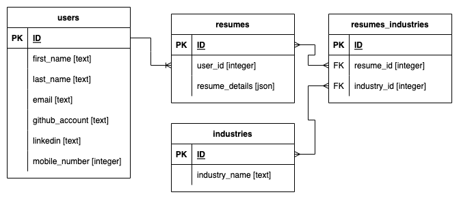
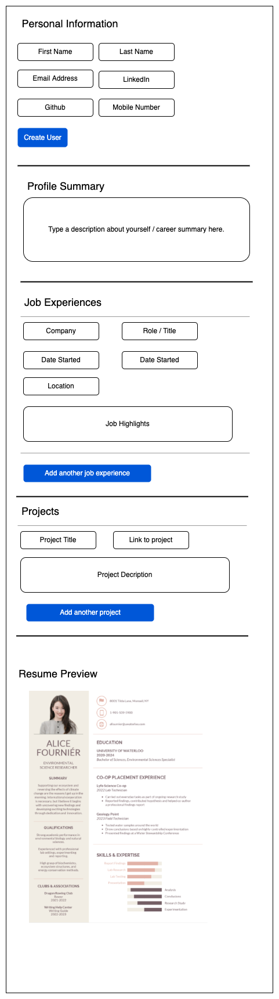

# Resume Builder

## Problem Statement

Provide an easy way to create and update resumes for job applications

## Database Relations

- One to Many
  - User can create multiple resumes
- Many to Many
  - Categorisation of resumes by industry eg. Finance, IT, Manufacturing
  - An industry category can have multiple resumes
  - Resumes can also be classified into multiple industries

## CRUD functionalities

- Create
  - User can create new resume
- Retrieve
  - User can review list of resumes created
- Update
  - User can update specific sections of the resume
- Delete
  - User can delete entire resumes

## ERD Diagram

## Wireframe Diagram

## Milestones

### Base

- CRUD routes

### Comfortable

- User login and authentication to support different profiles
